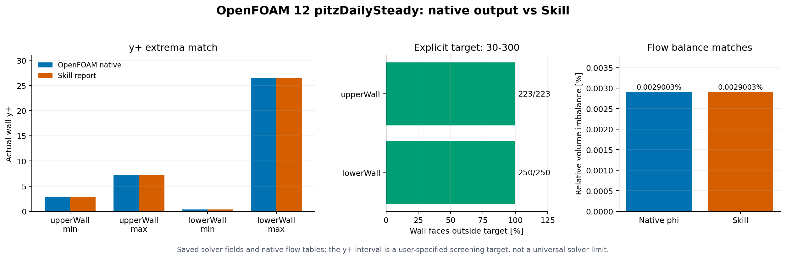
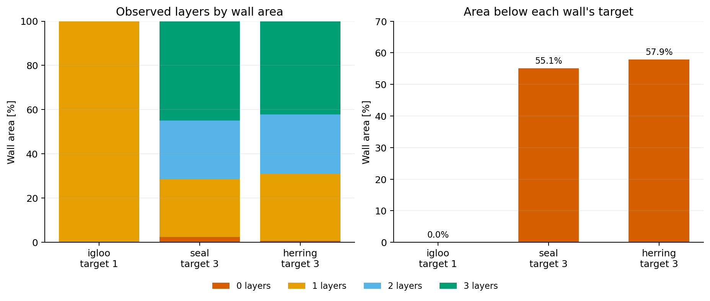
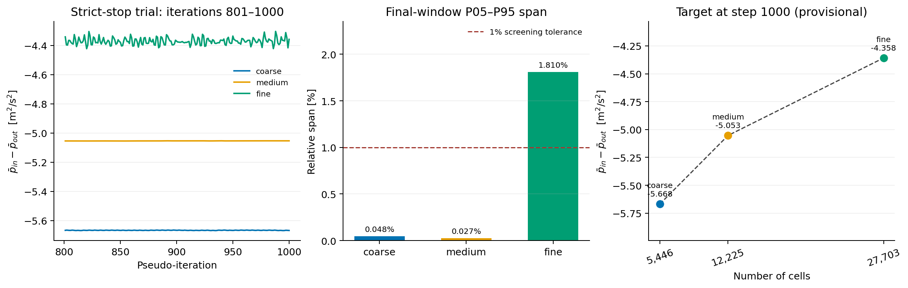

# mesh-quality-check

CFD 网格质量与算例适用性检查 Skill：**识别来源 → 检查网格 → 结合工况和已有试算判断 → 输出位置明确的优化建议**。

| 输入 | 识别为 | 检查方式 |
|---|---|---|
| OpenFOAM 算例目录 / `constant/polyMesh` / `.foam` | OpenFOAM | 有 checkMesh 时自动运行；ASCII polyMesh 额外用 Python 计算分布和坏面位置 |
| checkMesh 输出日志 | OpenFOAM | 解析日志 |
| Fluent `mesh/check`、`mesh/quality` 输出或 transcript | Fluent | 解析日志（含最差单元的 zone 和坐标） |
| Fluent `.msh` / `.cas(.h5)` | Fluent | 有 Fluent 时批处理运行；否则生成 journal，ASCII `.msh` 另用通用路线评估 |
| Gmsh `.msh` | Gmsh | meshio + VTK 指标，按物理组定位 |
| `.vtk/.vtu/.cgns/.inp/.med/...` | 通用 | meshio + VTK 指标 |

## 在 Codex 中安装和调用

直接告诉 Codex 要安装的 Skill（第一轮）：

```text
$skill-installer 请从 GitHub 仓库 Kolihanar/mesh-quality-check 的根目录安装
mesh-quality-check Skill（--path . --name mesh-quality-check）。
```

若不使用自动安装，也可按 [OpenAI 官方 Skill 文档](https://learn.chatgpt.com/docs/build-skills)把 Skill 放在用户级 `$HOME/.agents/skills`，并在提示词中显式提及。Windows PowerShell 示例：

```powershell
New-Item -ItemType Directory -Force "$HOME/.agents/skills" | Out-Null
git clone https://github.com/Kolihanar/mesh-quality-check.git "$HOME/.agents/skills/mesh-quality-check"
py -m pip install -r "$HOME/.agents/skills/mesh-quality-check/requirements.txt"
```

已有本仓库副本时，可直接让 Codex 读取其 `SKILL.md` 体验，不必重复克隆。新安装的 Skill 若未出现，重启 Codex。Linux/WSL 中用 `python3` 替代 `py`，并把依赖安装到实际运行脚本的 Python 环境；OpenFOAM 程序需在已加载其环境的终端运行。完整安装、提示词和案例演示见 [Codex 使用指南](reference/codex_demo.md)。

安装完成后，在下一轮用 Skill 检查自己的算例：

```text
$mesh-quality-check 请检查 OpenFOAM 12 单相 RANS 内流算例 <算例绝对路径>，
已有 log.checkMesh 位于 <日志绝对路径>。请实际运行检查，读取报告中的
overall、readiness 和 cfd.missing，按位置给出网格优化建议；缺少流动参数时不要猜测 y⁺。
```

**预期效果：**Codex 实际运行检查并生成 `mesh_report.md`、`mesh_report.json`，说明网格问题的数值、范围与位置，分别报告 `overall`、`readiness`、`cfd.missing`，再给出可执行的网格修改和复查建议。若改用 Skill 自带的 `tests/samples/of_inverted_3d` 合成样例演示，预期检出 `overall=critical`、`readiness=必须修复网格`；真实算例的结果取决于实际网格和工况证据。

## 直接使用

```bash
python scripts/mesh_check.py <算例目录或文件> -o report_dir
python scripts/mesh_check.py case/ --checkmesh-log case/log.checkMesh -o report_dir
```

输出 `mesh_report.md`（中文报告）和 `mesh_report.json`（结构化结果），视情况附带 `log.checkMesh`、`fluent_mesh_check.jou`、`mesh_quality.vtu`。

### OpenFOAM 单相 RANS 内流

```bash
python scripts/mesh_check.py case/ --context cfd_context.json -o report_dir
python scripts/mesh_check.py case/ --context cfd_context.json --yplus-field case/1000/yPlus -o report_dir
python scripts/mesh_check.py case/ --context cfd_context.json --layer-field case/1/nSurfaceLayers -o report_dir
```

工况文件格式、单位和输入来源见 [`reference/cfd_openfoam.md`](reference/cfd_openfoam.md)。工具直接计算实际网格的首层单元中心距及首层附近的非正交性、歪斜度；有摩擦速度和黏度时估算计算前 y⁺，有 ASCII `yPlus` 场时复核试算后 y⁺。若生成了 ASCII `nSurfaceLayers` 场，工具会自动读取壁面实际层数并计算面积加权覆盖率和缺层位置；也可用 `--layer-field` 显式指定。实际层增长率仍可通过工况文件提供，报告注明外部测量来源。已有试算的质量通量或恒密度流体积通量、能量通量、监测量及三套网格目标量也可纳入复核。与当前网格匹配的原生 `checkMesh` 结果是完整适用性判断的必要证据。官方算例验证路线见 [`reference/official_validation.md`](reference/official_validation.md)。

报告的 `overall` 表示**已执行的网格质量指标**，`readiness` 表示当前 CFD 适用性判断；`cfd.missing` 列出还缺少的关键证据。没有可用检查数据时退出码为 3，不会给出“可接受”。“按优先级排列的网格优化建议”一节列出位置、证据、修改办法和复核方法。

## 官方算例演示：原生数据与 Skill 对照

下面三幅图使用 OpenFOAM Foundation 12 官方教程的**实际网格与试算输出**。图中的核对脚本、原生日志、场文件、报告和复现步骤都在对应案例目录中；这些结果展示特定检查路径的有效性，不是所有 CFD 网格的通用合格证明。

### 1. 实测 y⁺、目标偏离和体积守恒



`pitzDailySteady` 的两面 y⁺ 极值与 OpenFOAM 原生日志一致；本次**显式设置** 30–300 筛查目标后，Skill 标出 upperWall 223/223 面、lowerWall 250/250 面在目标外。体积通量相对不平衡在原生数据和报告中均约为 **0.0029003%**。这说明场数据解析、目标偏离和守恒计算可核对；该壁面函数有低 y⁺ 分支，不能由低于 30 直接推断计算失败。[原生输出、报告与核对脚本](validation/official_openfoam12/README.md)。

### 2. “有边界层”与“达到目标层数”



`iglooWithFridges` 的两个冰柜壁面虽有约 **97.51% / 99.27%** 的正层覆盖面积，仍分别有 **55.10% / 57.88%** 的面积未达到三层目标。原生 `checkMesh` 还报告 **1,733 个凹单元、1 项检查失败**；Skill 同时保留这项失败。该案例验证实际层数和风险识别，网格尚不能作为可用于求解的正例。[原生层字段、报告与独立面积核对](validation/official_openfoam12_igloo/README.md)。

### 3. 残差收敛后仍检查目标量稳定性



三网格续算至 1000 步后，细网格压力目标量末两段均值漂移约 **0.27%**，但最后窗口 P05–P95 相对跨度仍为 **1.81%**，超过本次 1% 筛查容差。Skill 因此将细/中网格差异标为**初步比较**，不会宣称已得到可靠的网格收敛。[原生监测数据、报告与核对脚本](validation/official_openfoam12_grid/README.md)。

复制 [Codex 案例演示提示词](reference/codex_demo.md) 可让 Codex 逐项运行三份独立核对脚本，并链接这些图与报告。合成回归样例的图和边界见 [验证图说明](validation/summary.md)。

## 调整阈值

所有阈值在 `scripts/thresholds.json`，按软件分开。改动后运行 `python tests/run_tests.py` 确认回归测试仍通过（若期望结果随之改变，同步修改 `tests/run_tests.py` 中的 CASES）。
OpenFOAM CFD 路线可另运行 `python tests/test_cfd.py`。

当前回归结果及三张合成样例验证图见 [验证图说明](validation/summary.md)。运行 `python validation/generate.py` 可重新生成其 PNG、SVG 和 `evidence.json`；其中近壁示例的 y⁺、层数为人为赋值。[motorBikeSteady 加层实测](validation/official_openfoam12_motorbike/README.md) 另补充外流复杂 patch 名的字段验证。重绘本页第一幅实测图可运行 `python validation/official_openfoam12/plot_comparison.py`。

公开的验证日志和报告已将运行者账号、主机名及本机路径替换为示例值；网格、求解和检查数值未改动。`validation/official_openfoam12_igloo/native.sha256` 记录匿名化后保存文件的 SHA-256。

## 扩展到新软件

1. 在 `detect.py` 里加入识别规则；
2. 在 `scripts/adapters/` 新建适配器，返回与现有适配器相同结构的结果（`mesh_info`、`findings`、`limitations`）；
3. 在 `thresholds.json` 增加该软件的阈值，在 `reference/` 写一份指标说明；
4. 在 `mesh_check.py` 中注册，并在 `tests/` 加样例。
