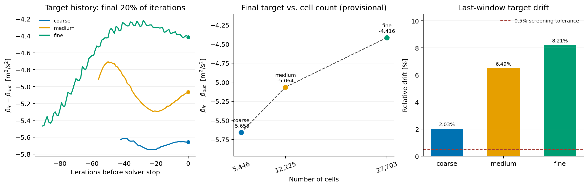

# OpenFOAM 12 官方内流算例：三网格与目标量监测验证

2026-10-04 在用户已编译的 OpenFOAM Foundation 12 上，从官方 `incompressibleFluid/pitzDailySteady` 建立粗、中、细三套二维单相 RANS `kEpsilon` 算例。只改 `blockMeshDict` 的五组单元数；初始场、物性、湍流模型、边界条件、离散格式、求解控制和监测配置逐文件 SHA-256 一致，见 [`evidence.json`](evidence.json)。每套均实际运行 `blockMesh`、`checkMesh -allGeometry -allTopology` 和 `foamRun`，在 `system/functions` 逐迭代输出入口/出口面积平均运动压力与体积通量。细网格另外运行了 `yPlus`。

| 网格 | 单元数 | 原生 checkMesh | SIMPLE 停止迭代 | 末次入口−出口平均运动压力 (m²/s²) | 压力监测末两段均值漂移 |
|---|---:|---|---:|---:|---:|
| 粗 | 5,446 | Mesh OK | 214 | −5.658197 | 2.03% |
| 中 | 12,225 | Mesh OK | 286 | −5.064117 | 6.49% |
| 细 | 27,703 | Mesh OK | 461 | −4.415714 | 8.21% |

中/粗末次目标量相对变化 10.50%，细/中 12.80%，均超过本次 2% 筛查容差。三套网格的末段漂移也都超过 0.5% 监测容差。**因此这些末次值只能用于发现问题，不能据此宣布已得到可靠的网格收敛结果或计算严格 GCI。** 原生 SIMPLE 的“solution converged”表示算例配置的残差停止条件被满足，不能替代目标量稳定性检查。细网格出入口体积通量相对不平衡仅约 0.0041%，但守恒良好同样不能消除目标量的漂移。



图中压力为 OpenFOAM 不可压缩流的**运动压力**差 `p_inlet − p_outlet`，不是 Pa 单位的物理压降；该后向台阶算例的差值为负。中图的末次值比较标为初步结果，因为各网格目标量仍在变化。细网格的实际 y⁺ 为 upperWall 1.6225–5.54864、lowerWall 0.119264–16.3969。报告为检验目标偏离检测而显式采用 30–300 筛查区间；OpenFOAM 12 当前壁面函数具有低 y⁺ 分支，不能单凭区间偏离判断求解失败。

## 更严格停止条件的独立续算

随后在三套原算例的**副本**上从各自最新结果续算，将 SIMPLE 残差目标统一收紧为 `p=1e-4`、`U=1e-5`、湍流量 `1e-5`，最多运行至 1000 步。三套都到达 1000 步上限，没有触发新残差目标。原生续算监测表和求解日志保存于本目录；[`extended_evidence.json`](extended_evidence.json) 记录独立统计，细网格的实际 y⁺ 重新在时间 1000 计算。

| 网格 | 时间 1000 的压力差 (m²/s²) | 末两段均值漂移 | 最后 20% 迭代的 P05–P95 相对跨度 |
|---|---:|---:|---:|
| 粗 | −5.667960 | 0.0014% | 0.048% |
| 中 | −5.053480 | 0.0102% | 0.027% |
| 细 | −4.357891 | 0.2684% | **1.810%** |

细网格的均值漂移低于本次 0.5% 容差，但仍存在超过 1% 筛查容差的往复波动；只比较两个窗口的均值会漏报。Skill 新增 P05–P95 末段波动检查，并在[`续算报告`](extended_report/mesh_report.md)中继续把细/中末次值约 13.76% 的差异标为**初步比较**。这些阈值仅为本次目标量的筛查设置；稳态伪时间迭代的均值不能当作物理时间平均解，也不构成严格 GCI。


## 复现

以下命令假设本 Skill 在 `/absolute/path/to/mesh-quality-check`，OpenFOAM 12 在 `~/OpenFOAM/OpenFOAM-12`。[`prepare_cases.py`](prepare_cases.py) 创建新的算例副本，若目标已存在会拒绝覆盖；复现时可先按需修改脚本中的日期后缀。官方教程自带 `system/functions`，所以监测对象必须添加到该文件中。若同时在 `controlDict/functions` 添加，OpenFOAM 12 会忽略后者。

```bash
source "$HOME/OpenFOAM/OpenFOAM-12/etc/bashrc" ParaView_TYPE=none SCOTCH_TYPE=none ZOLTAN_TYPE=none
skill=/absolute/path/to/mesh-quality-check
python3 "$skill/validation/official_openfoam12_grid/prepare_cases.py"
for grade in coarse medium fine; do
    case_dir="$HOME/OpenFOAM/${USER}-12/run/pitzDailySteady-grid-${grade}-monitored-20261004"
    blockMesh -case "$case_dir" > "$case_dir/log.blockMesh" 2>&1
    checkMesh -case "$case_dir" -allGeometry -allTopology > "$case_dir/log.checkMesh" 2>&1
    foamRun -case "$case_dir" > "$case_dir/log.foamRun" 2>&1
done
fine_case="$HOME/OpenFOAM/${USER}-12/run/pitzDailySteady-grid-fine-monitored-20261004"
foamPostProcess -case "$fine_case" -solver incompressibleFluid -func yPlus -latestTime > "$fine_case/log.yPlus" 2>&1
python3 "$skill/validation/official_openfoam12_grid/extract_evidence.py"
python3 "$skill/scripts/mesh_check.py" "$fine_case" \
    --context "$skill/validation/official_openfoam12_grid/context.json" \
    --checkmesh-log "$fine_case/log.checkMesh" \
    -o "$skill/validation/official_openfoam12_grid/report"
python3 "$skill/validation/official_openfoam12_grid/extend_cases.py" coarse medium fine
for grade in coarse medium fine; do
    case_dir="$HOME/OpenFOAM/${USER}-12/run/pitzDailySteady-grid-${grade}-extended-20261004"
    foamRun -case "$case_dir" > "$case_dir/log.foamRun.extended" 2>&1
done
extended_fine="$HOME/OpenFOAM/${USER}-12/run/pitzDailySteady-grid-fine-extended-20261004"
foamPostProcess -case "$extended_fine" -solver incompressibleFluid -func yPlus -latestTime > "$extended_fine/log.yPlus.extended" 2>&1
python3 "$skill/validation/official_openfoam12_grid/assess_extended.py"
python3 "$skill/scripts/mesh_check.py" "$extended_fine" \
    --context "$skill/validation/official_openfoam12_grid/extended_context.json" \
    --checkmesh-log "$extended_fine/log.checkMesh" \
    -o "$skill/validation/official_openfoam12_grid/extended_report"
python3 "$skill/validation/official_openfoam12_grid/verify.py"
python3 "$skill/validation/official_openfoam12_grid/plot.py"
```

Skill 两轮均预期返回退出码 2，表示识别到高风险。[`verify.py`](verify.py) 独立读取保存的原生 `checkMesh`/求解日志及 `surfaceFieldValue.dat`，逐项核对两轮报告中的单元数、迭代、压力、通量、漂移、波动和网格差异。下一步应先使细网格目标量及残差进一步稳定，再重新比较网格；然后按壁面剪切与目标压力分布决定加密位置。此算例不包含换热和实际加层字段；真实封闭内流加层另见 [`../official_openfoam12_igloo/README.md`](../official_openfoam12_igloo/README.md)，换热守恒仍需后续验证。
